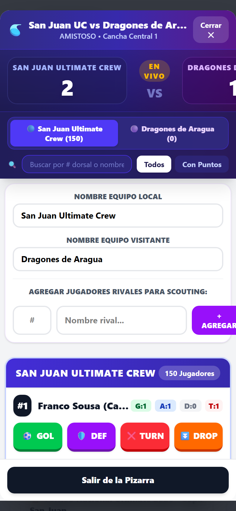
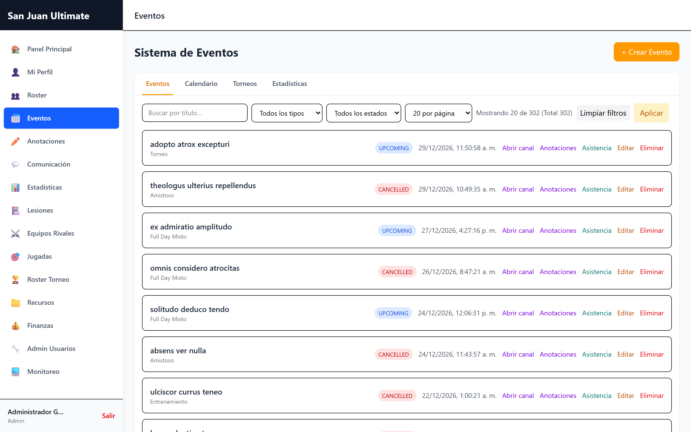
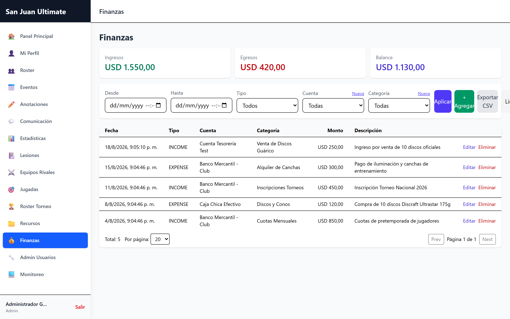
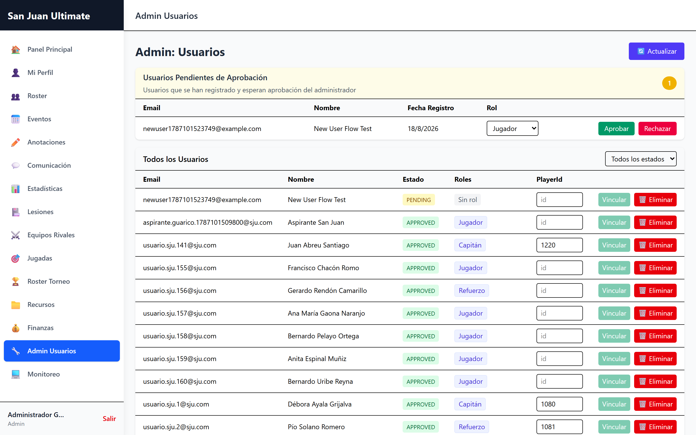

# 🥏 SIGEDIVO (Sistema de Gestión para el Disco Volador) — Plataforma de Gestión Deportiva del Disco Volador


---

## 🇻🇪 Dedicatoria y Contexto Deportivo

> *"Este proyecto es mi contribución de corazón a la comunidad venezolana y del mundo para el Ultimate Frisbee / Disco Volador, el deporte más bonito del mundo."*  
> **— Frank Sousa** (`frankSousa23`), San Juan de los Morros, Estado Guárico, Venezuela.

Durante más de 15 años compitiendo y promoviendo el Disco Volador en **San Juan de los Morros (Guárico)**, **Aragua, Carabobo, Yaracuy, Miranda, Distrito Capital** y diversas regiones de Venezuela, presencié la imperiosa necesidad de contar con una herramienta tecnológica abierta, moderna, robusta y gratuita para organizar clubes, planificar torneos, llevar estadísticas en tiempo real y profesionalizar los eventos deportivos.

**SIGEDIVO** nace con el firme propósito de respaldar a la **Federación del Disco Volador de Venezuela (FDVV)**, a la **Asociación Aragüeña del Disco Volador (AADV)** y sentar las bases tecnológicas y organizativas para la creación y consolidación de la **Asociación Guariqueña del Disco Volador (AGDV)** y organizaciones hermanas en toda Latinoamérica y el mundo.

---

## 📖 Licencia Pública, Open Source (MIT) y Términos de Uso

Este proyecto es software libre y de código abierto bajo la **[Licencia MIT](LICENSE)**.

### 🌟 Cláusulas de Uso y Atribución
- **Uso Libre y Gratuito:** Cualquier club deportivo, liga, federación, colegio, universidad o desarrollador en Venezuela y el mundo puede utilizar, desplegar y adaptar este sistema libremente.
- **Atribución Obligatoria:** Todo uso, bifurcación (*fork*) o proyecto derivado debe incluir el reconocimiento explícito y el enlace al repositorio oficial:
  > **Repositorio Oficial:** [https://github.com/frankSousa23/San-Juan-Ultimate-Crew](https://github.com/frankSousa23/San-Juan-Ultimate-Crew)  
  > **Autor:** Frank Sousa (`frankSousa23`) & SIGEDIVO (Sistema de Gestión para el Disco Volador).
- **Aportes y Mejoras Comunitarias:** ¡Toda contribución es bienvenida! Si deseas proponer nuevas funcionalidades, optimizaciones o reportar mejoras, te invitamos a abrir un *Pull Request* o *Issue*.

---

## 📸 Galería de Vistas y Funcionalidades

A continuación, se presenta un recorrido visual por los módulos principales de SIGEDIVO, diseñados bajo una arquitectura limpia, responsiva y orientada a la experiencia del usuario (UX) en campo.

### 🔐 1. Inicio de Sesión y Modo Demostración
El portal de acceso seguro del sistema. Cuenta con validación JWT, un diseño responsivo de alto contraste y un **Modo Invitado de 1 Clic** que permite explorar un ecosistema completo de demostración sin necesidad de registro.


### 📊 2. Dashboard Principal
El panel de control (Dashboard) ofrece una vista panorámica en tiempo real del club. Integra widgets rápidos de estado del Roster (jugadores activos y lesionados), próximos torneos y un resumen financiero inmediato.


### 🏃 3. Roster y Perfil de Atletas
Gestión completa de la plantilla oficial. Permite organizar a los jugadores por línea de juego, posición (Handler, Cutter, Híbrido), y enlazar su estado médico y estadísticas históricas.


### ⏱️ 4. Pizarra Táctica y Anotaciones en Vivo (Móvil y Escritorio)
El corazón estadístico del sistema. Diseñado específicamente para ser usado en el campo de juego desde una Tablet o Smartphone. Los botones son táctiles y de gran tamaño para registrar asistencias, goles, defensas (D's) y pérdidas al instante.
<div align="center">
  
  
</div>

### 📅 5. Eventos, Torneos, Convocatorias y Mesa Técnica
Módulo de logística deportiva para coordinar prácticas, partidos oficiales, caimaneras y torneos multinivel con plantillas rápidas. Incluye confirmación de asistencia (RSVP), control de mesa técnica, fases de grupo, semifinales y finales.


### 📈 6. Estadísticas de Rendimiento (Analytics)
Procesamiento de datos en tiempo real (Puntos Jugados, +/- Plus/Minus, Goles, Asistencias) que alimenta tablas de líderes y permite al cuerpo técnico tomar decisiones informadas sobre las líneas.


### 💰 7. Control de Finanzas y Tesorería
Herramienta contable dedicada a la Directiva y Tesorería del club. Seguimiento riguroso de pagos de mensualidades, inscripción a torneos (Bid Fees), compra de discos y control del balance (Caja Chica y Cuentas Bancarias).


### 📋 8. Libro de Jugadas (Playbook) Tácticas
Un espacio formativo y estratégico donde los entrenadores (Coaches) publican las formaciones oficiales del equipo (e.g. *Vertical Stack*, *Horizontal Stack*, *Defensa Cup*).


### 🏥 9. Parte Médico y Gestión de Lesiones
Un seguimiento evolutivo de las lesiones de los atletas, desde el momento del incidente hasta la recuperación total (Alta médica), permitiendo a los entrenadores proteger la salud física del roster.


### 🛡️ 10. Scouting de Rivales
Base de datos técnica de equipos adversarios. Permite almacenar puntos fuertes, tácticas habituales y análisis detallado de jugadores clave para planificar estrategias previas a los encuentros.


### ⚙️ 11. Administración del Sistema y Equipos (Directiva)
Panel exclusivo para la Administración. Desde aquí se aprueban las solicitudes de nuevos atletas, se asignan roles (Capitán, Entrenador, Directiva, Tesorero, Anotador, Marketing) y se gestionan los diferentes equipos y categorías que conviven en el sistema.


---

## 🚀 Módulos y Funcionalidades del Sistema

### 0. 🛡️ Arquitectura Multi-Equipo y Multi-División
- **Aislamiento Seguro de Datos:** Soporte nativo para la coexistencia de múltiples equipos, clubes o categorías (Open, Femenino, Mixto, Master) en una sola instancia.
- **Gestión de Equipos (`/admin/equipos`):** Creación, configuración de paleta cromática, escudos y monitoreo de métricas agregadas por división.
- **Selector de Equipo en Registro:** Integración fluida en `/register` para que los nuevos atletas elijan su equipo o ingresen como independientes.
- **Dorsales Independientes:** Eliminación de bloqueos globales en números de camiseta con indexación compuesta `@@index([teamId, number])`.
- **Acceso Contextual:** Jugadores, capitanes y entrenadores operan con privacidad de roster, jugadas y finanzas.

### 1. ⏱️ Pizarra Táctica y Anotaciones en Vivo (Optimizada para Torneo y Móvil)
- **Diseño Ultra-Responsive y Táctil:** Adaptado para tablets y teléfonos móviles en campo de juego con botones de gran tamaño (`touch-manipulation`, `active:scale-95`).
- **Marcador Gigante Sticky:** Marcador en tiempo real siempre visible en la parte superior al hacer scroll.
- **Registro Rápido en Vivo:**
  - ⚽ **Goles** con asignación táctil del asistente (`relatedPlayerId`).
  - ⚡ **Acceso Directo:** "Sin Asistencia / Callahan / Error Rival" en 1 toque.
  - 🛡️ **Defensas (D)** e intercepciones.
  - ❌ **Pérdidas (Turnovers)**.
- **Modos de Juego:**
  - **Modo Torneo / Versus:** Enfrentamientos oficiales contra equipos rivales con scouting de jugadores.
  - **Modo Caimanera Interno:** Partidos mixtos de práctica entre Equipo Claro vs Equipo Oscuro.
  - **Fusión de Invitados:** La Mesa Técnica puede registrar a jugadores invitados en una caimanera y migrar atómicamente todo su historial de goles y asistencias al jugador una vez apruebe su cuenta oficial.
- **Sincronización Automática:** Alimenta al instante la tabla de estadísticas de partido (`PlayerMatchStats`) y la evaluación de Espíritu de Juego (SOTG).

### 2. 🏃 Roster y Perfil de Jugadores
- Registro de dorsales por equipo, posiciones tácticas (Manejador/Handler, Cortador/Cutter, Híbrido).
- Estado físico (Activo, Lesionado, Inactivo), estatura, experiencia y vinculación bidireccional con usuarios.

### 3. 📅 Eventos, Torneos, Convocatorias y Mesa Técnica
- Jerarquía de torneos padres con partidos asociados (`GROUP_STAGE`, `QUARTER_FINALS`, `SEMI_FINALS`, `FINALS`).
- Plantillas de creación rápida con presets por categoría (*Torneo Open Masc/Fem, Full Day Open/Mixto, Amistoso Interclub, Caimanera Interna*).
- Protección interactiva de modal contra clics accidentales de fondo.
- Convocatoria de jugadores asignados a líneas tácticas (**O-Line**, **D-Line**, **Flex**).
- Registro de asistencia en tiempo real (`presente`, `tarde`, `ausente`).
- Control de Mesa Técnica para asignación de anotadores oficiales y bloqueos de seguridad.

### 4. 💰 Finanzas y Tesorería
- Cuentas bancarias y caja chica, categorización de ingresos/egresos y cálculo automático de balances.

### 5. 🏥 Historial Médico y Lesiones
- Seguimiento evolutivo del estado del jugador (Activo -> En Recuperación -> Resuelto).

### 6. 📋 Libro de Jugadas y Estrategia (Playbook)
- Pizarra de jugadas ofensivas (Vertical Stack, Horizontal Stack) y defensivas (Zona 3-3-1 Cup, Defensa Dome/Clam).

### 7. 🛡️ Scouting de Rivales
- Fichas técnicas de equipos contrarios y scouting individual de jugadores clave.

### 8. 💬 Comunicaciones, Noticias y Recursos
- Canales en tiempo real vinculados a torneos, noticias oficiales y reglamento oficial WFDF.

### 9. 📄 Manual del Sistema y Generador de PDFs
- Visualizador interactivo de manual de operaciones, organigrama de roles y permisos RBAC, diagramas tácticos WFDF y exportación directa en formato PDF de alta fidelidad.
- Biblioteca de documentos oficiales descargables: Reglamento WFDF 2025/2026, Rúbrica SOTG, Manual de Señales de Mano, Protocolo de Mesa Técnica, Guía de Drills y Formaciones Tácticas.

---

## 👥 Matriz de Roles y Permisos (RBAC)

| Rol | Roster | Eventos / Torneos | Anotaciones en Vivo | Finanzas | Jugadas / Playbook | Admin Usuarios / Equipos |
| :--- | :---: | :---: | :---: | :---: | :---: | :---: |
| **admin** | Total | Total | Total | Total | Total | Total |
| **directiva** | Total | Total | Total | Total | Total | Total |
| **captain** | Edición | Creación / Gestión | Total | Lectura | Edición | No |
| **coach** | Edición | Creación / Gestión | Total | No | Edición | No |
| **annotator** | Lectura | Lectura / Mesa | Total | No | Lectura | No |
| **treasurer** | Lectura | Lectura | Lectura | Total | Lectura | No |
| **marketing** | Lectura | Lectura | Lectura | No | Lectura | No |
| **player** | Edición Propia | Lectura / RSVP | Lectura | No | Lectura | No |
| **guest** | Lectura Demo | Lectura Demo | Lectura Demo | Lectura Demo | Lectura Demo | No |

---

## 🛠️ Stack Tecnológico

| Capa | Tecnología |
| :--- | :--- |
| **Frontend** | React 18, Vite 6, TypeScript, Tailwind CSS, jsPDF, React Hot Toast |
| **Backend API** | Node.js, Express, TypeScript, Prisma ORM 7 (`@prisma/adapter-pg`) |
| **Base de Datos** | PostgreSQL 16 (con capa de persistencia en memoria y pooling automático) |
| **Testing** | Vitest (Unit & Integration API), Playwright (E2E & Accesibilidad WCAG) |
| **Documentación** | Swagger UI / OpenAPI 3.0 en `/api-docs` y manuales en `/docs` |

---

## ⚡ Inicio Rápido en Desarrollo Local

```bash
# 1. Clonar el repositorio
git clone https://github.com/frankSousa23/San-Juan-Ultimate-Crew.git
cd San-Juan-Ultimate-Crew

# 2. Instalar dependencias
npm install

# 3. Configurar variables de entorno
cp .env.example .env

# 4. Iniciar la aplicación
npm run dev
```

- **Aplicación Web:** [http://localhost:3000](http://localhost:3000)
- **Documentación OpenAPI / Swagger:** [http://localhost:3000/api-docs](http://localhost:3000/api-docs)

---

## 🔐 Control de Acceso y Modo Demostración

- **Acceso de Demostración (Modo Invitado en 1 Clic):**  
  En la pantalla de inicio de sesión (`/login`), se incluye un botón de **Acceso Demostrativo en 1 Clic** que permite explorar de forma inmediata el Roster, Calendario, Pizarrón Táctico, Estadísticas, Finanzas y el Manual Oficial sin requerir registro previo ni configuración manual.
- **Registro Seguro y Aprobación Administrativa:**  
  Los nuevos registros de usuarios ingresan en estado `PENDING` para ser validados y asignados a su rol (`admin`, `directiva`, `captain`, `coach`, `annotator`, `treasurer`, `marketing`, `player`) y equipo desde el panel de administración (`/admin/usuarios`).

---

## 🌐 Guía de Despliegue en Producción

Para desplegar este sistema en servidores VPS (con Docker, Nginx y SSL Certbot) o en plataformas en la nube (Render, Railway, Neon, Vercel), consulta la guía detallada:

👉 **[Guía Oficial de Despliegue (DEPLOYMENT_GUIDE.md)](docs/DEPLOYMENT_GUIDE.md)**

---

## 🧪 Comprobación de Calidad y Tests

El proyecto cuenta con un entorno estricto de control de calidad usando `eslint`, `tsc` (TypeScript), `vite` y `playwright`.

```bash
# Verificación de compilación TypeScript y Lint
npm run lint

# Compilación completa para producción (Cliente + Servidor)
npm run build

# Pruebas End-to-End
npm run test:e2e
```

---

## 🤝 Contribuciones

1. Haz un Fork del repositorio.
2. Crea tu rama (`git checkout -b feature/nueva-mejora`).
3. Realiza tus cambios y verifica con `npm run build`.
4. Haz Commit (`git commit -m 'feat: agregar funcionalidad'`).
5. Sube tu rama (`git push origin feature/nueva-mejora`).
6. Abre un **Pull Request**.

---

## 📄 Licencia

Distribuido bajo la Licencia MIT. Consulta el archivo [LICENSE](LICENSE) para más información.

---

## 📚 Documentación Técnica Adicional

- [Reporte de Evaluación Beta y Deploy](./docs/REPORTE_BETA_DEPLOY.md): Auditoría completa del sistema en producción en Seenode con capturas de pantalla y matriz de estado.
- [Presentación Oficial para Exposición Pública](./docs/presentacion_sigedivo_publico.html): Diapositivas interactivas animadas listas para proyectar ante federaciones, clubes y conferencias (con exportación a PDF).
- [Guía Oficial de Despliegue en Producción](./docs/DEPLOYMENT_GUIDE.md): Configuración de Docker, PostgreSQL, variables de entorno, dominio y certificados SSL.
- [Diagramas de Flujo Oficiales del Sistema](./docs/DIAGRAMAS_DE_FLUJO.md): Documentación visual unificada con todos los diagramas de arquitectura, seguridad, partidos en vivo y finanzas en Mermaid.
- [Visualizador Interactivo de Diagramas](./docs/diagramas_flujo_visualizador.html): Visor gráfico autónomo con renderizado en tiempo real y exportación a PDF.
- [Diagrama de Flujo de Datos](./docs/FLUJO_DE_DATOS.md): Ciclo de vida y arquitectura del sistema, autenticación JWT/RBAC, flujo multi-equipo, eventos y cálculo de estadísticas.
- [Estrategia y Guía Oficial de Testing](./docs/TESTING.md): Pirámide de pruebas, suite de Playwright, Vitest y validaciones críticas.
- [Workflow de Pruebas Paso a Paso](./docs/WORKFLOW_DE_PRUEBAS.md): Guía de validación de flujos de negocio y datos precargados.
- [Recomendaciones de Mejora y Escalabilidad](./docs/RECOMENDACIONES.md): Hoja de ruta para escalabilidad en la nube, marcadores en tiempo real (WebSockets), PWA offline y soporte federado.
