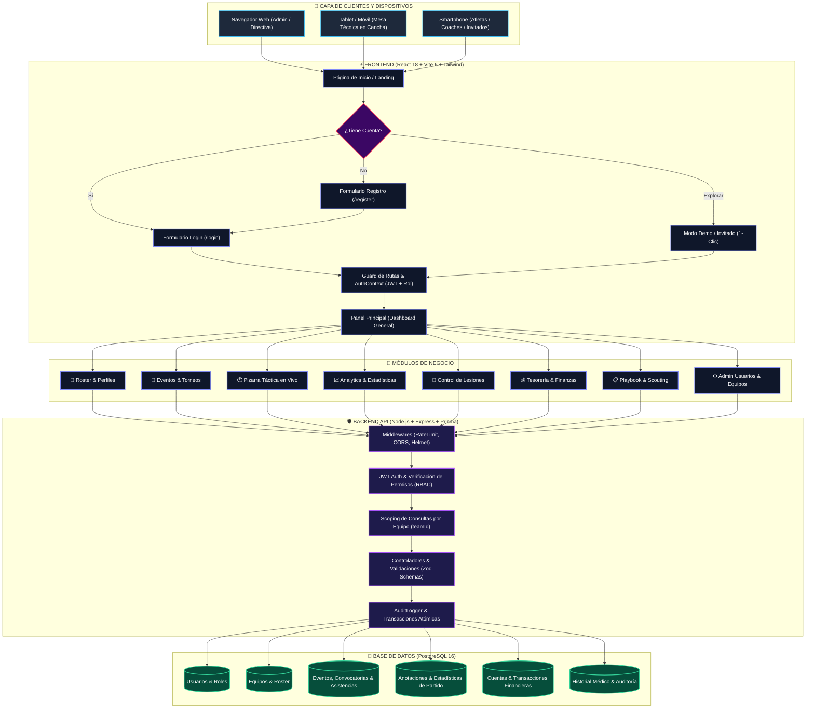
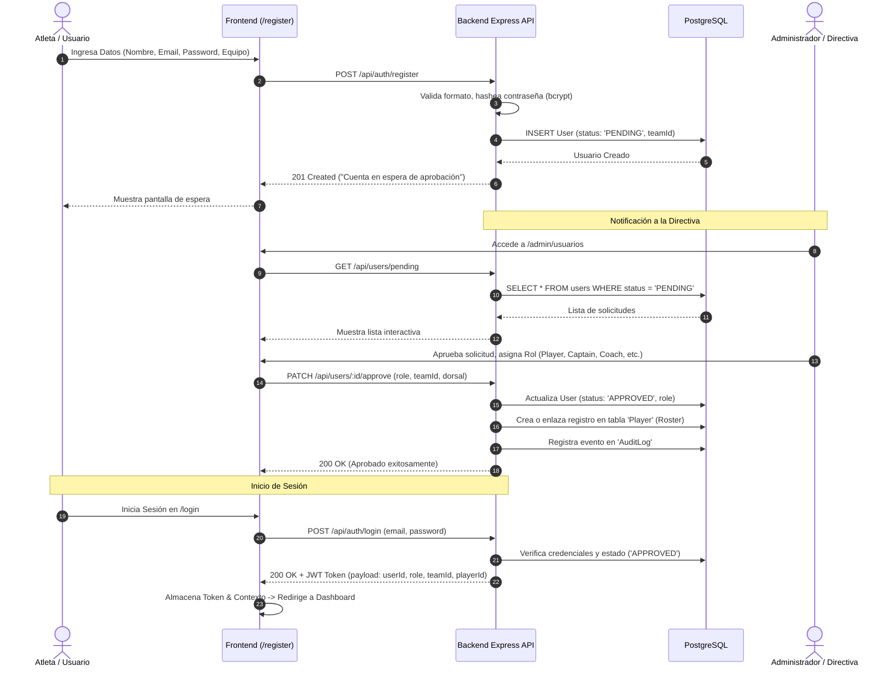
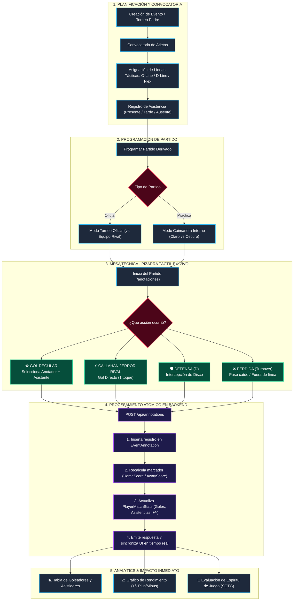
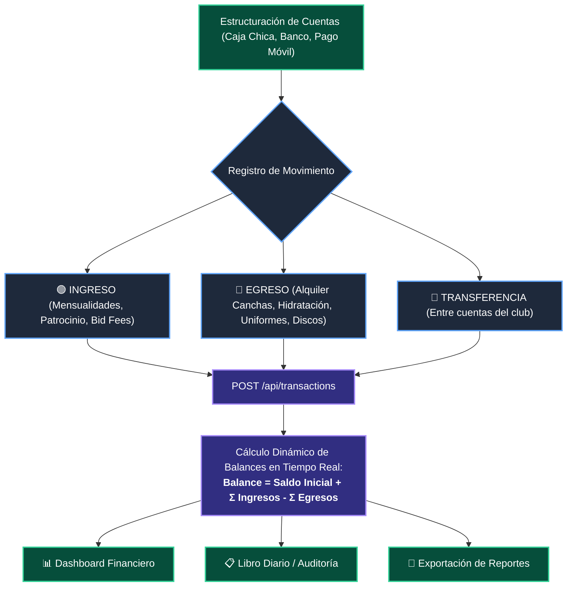
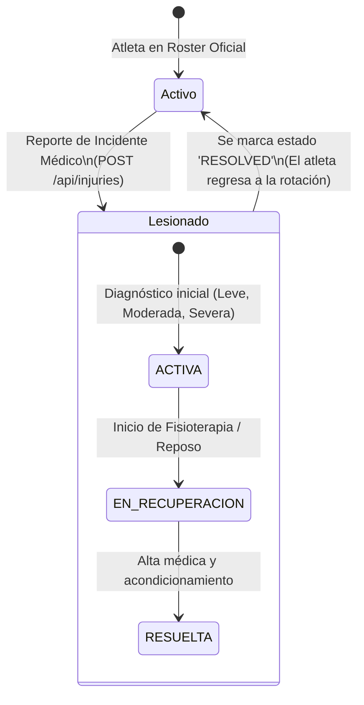

# 📊 Diagramas de Flujo Oficiales del Sistema — SIGEDIVO
### Sistema de Gestión para el Disco Volador (San Juan Ultimate Crew)

Este documento unifica y formaliza todos los **diagramas de flujo de trabajo, arquitectura, lógica de negocio y seguridad** de la plataforma SIGEDIVO. Está optimizado para renderizarse automáticamente en GitHub, VS Code, editores Markdown compatibles con Mermaid y en el visualizador HTML interactivo incluido en [`docs/diagramas_flujo_visualizador.html`](./diagramas_flujo_visualizador.html).

---

## 📑 Tabla de Contenidos
1. [Diagrama Maestro Global del Sistema](#1-diagrama-maestro-global-del-sistema)
2. [Flujo de Autenticación, Registro y Aprobación RBAC](#2-flujo-de-autenticación-registro-y-aprobación-rbac)
3. [Flujo Core Deportivo: Torneos, Convocatorias y Anotaciones en Vivo](#3-flujo-core-deportivo-torneos-convocatorias-y-anotaciones-en-vivo)
4. [Flujo de Fusión de Jugador Invitado a Jugador Oficial](#4-flujo-de-fusión-de-jugador-invitado-a-jugador-oficial-merge-guest)
5. [Flujo del Módulo Contable y Financiero (Tesorería)](#5-flujo-del-módulo-contable-y-financiero-tesorería)
6. [Flujo de Control Médico y Estado de Lesiones](#6-flujo-de-control-médico-y-estado-de-lesiones)
7. [Matriz de Permisos y Control de Acceso por Roles (RBAC)](#7-matriz-de-permisos-y-control-de-acceso-por-roles-rbac)
8. [Cómo Visualizar y Exportar estos Diagramas](#8-cómo-visualizar-y-exportar-estos-diagramas)

---

## 1. Diagrama Maestro Global del Sistema

Representa el recorrido integral de la plataforma, desde el acceso multidispositivo hasta la persistencia en base de datos y generación de analítica en tiempo real.

---

## 2. Flujo de Autenticación, Registro y Aprobación RBAC

El sistema garantiza la seguridad comunitaria mediante aprobación obligatoria de nuevos atletas antes de habilitar permisos de escritura o acceso a datos privados del equipo:

---

## 3. Flujo Core Deportivo: Torneos, Convocatorias y Anotaciones en Vivo

Módulo central para la gestión del partido desde la mesa técnica con sincronización atómica de estadísticas:

---

## 4. Flujo de Fusión de Jugador Invitado a Jugador Oficial (Merge Guest)

Permite recopilar datos durante caimaneras abiertas sin perder el historial al momento de la incorporación formal:

```mermaid
flowchart LR
    classDef temp fill:#78350f,stroke:#f59e0b,stroke-width:2px,color:#fff;
    classDef proc fill:#1e1b4b,stroke:#8b5cf6,stroke-width:2px,color:#fff;
    classDef done fill:#064e3b,stroke:#10b981,stroke-width:2px,color:#fff;

    subgraph CAMPO ["1. Durante la Caimanera"]
        T1["Mesa Técnica crea Jugador Temporal (RivalPlayer)"]:::temp
        T2["Se registran Goles y Asistencias con rivalPlayerId"]:::temp
        T1 --> T2
    end

    subgraph REGISTRO ["2. Registro Formal"]
        R1["El jugador se registra en el sistema"]:::proc
        R2["Admin aprueba y crea Player Oficial (playerId)"]:::proc
        T2 --> R1 --> R2
    end

    subgraph MERGE ["3. Transacción Atómica de Fusión"]
        M1["POST /api/players/:id/merge-guest"]:::proc
        M2["Busca anotaciones con rivalPlayerId"]:::proc
        M3["Transfiere autoría a playerId (isRefuerzo: true)"]:::proc
        M4["Elimina el perfil temporal de RivalPlayer"]:::proc
        R2 --> M1 --> M2 --> M3 --> M4
    end

    subgraph FINAL ["4. Resultado"]
        F1["Historial estadístico migrado al 100% sin pérdida de datos"]:::done
        M4 --> F1
    end
```

---

## 5. Flujo del Módulo Contable y Financiero (Tesorería)

Registro auditable de ingresos, egresos y transferencias con cálculo en tiempo real:

---

## 6. Flujo de Control Médico y Estado de Lesiones

---

## 7. Matriz de Permisos y Control de Acceso por Roles (RBAC)

| Módulo del Sistema | Admin | Directiva | Captain | Coach | Annotator | Treasurer | Player | Guest |
| :--- | :---: | :---: | :---: | :---: | :---: | :---: | :---: | :---: |
| **Roster & Jugadores** | ✏️ Total | ✏️ Total | ✏️ Total | ✏️ Total | 👁️ Lectura | 👁️ Lectura | ✏️ Propio | 👁️ Lectura |
| **Eventos & Torneos** | ✏️ Total | ✏️ Total | ✏️ Total | ✏️ Total | 👁️ Lectura | 👁️ Lectura | 🙋 RSVP | 👁️ Lectura |
| **Pizarra de Anotaciones** | ✏️ Total | ✏️ Total | ✏️ Total | ✏️ Total | ✏️ Total | 👁️ Lectura | 👁️ Lectura | 👁️ Lectura |
| **Finanzas & Tesorería** | ✏️ Total | ✏️ Total | 👁️ Lectura | ❌ | ❌ | ✏️ Total | ❌ | ❌ |
| **Historial Médico** | ✏️ Total | ✏️ Total | ✏️ Total | ✏️ Total | ❌ | ❌ | 👁️ Propio | 👁️ Lectura |
| **Gestión de Equipos** | ✏️ Total | ✏️ Total | ❌ | ❌ | ❌ | ❌ | ❌ | ❌ |
| **Administración Usuarios**| ✏️ Total | ✏️ Total | ❌ | ❌ | ❌ | ❌ | ❌ | ❌ |
| **Feedback Comunitario** | ✏️ Total | ❌ | ❌ | ❌ | ❌ | ❌ | ❌ | ❌ |

---

## 8. Cómo Visualizar y Exportar estos Diagramas

Tienes 3 formas inmediatas de usar y compartir estos diagramas:

1. **Visualizador Interactivo Local (Recomendado):** Abre en tu navegador el archivo [`docs/diagramas_flujo_visualizador.html`](./diagramas_flujo_visualizador.html). Te permite ver los diagramas con zoom, alternar modo claro/oscuro e imprimir/exportar a PDF.
2. **Visualización en GitHub / GitLab:** Al subir este archivo a tu repositorio, GitHub renderiza de forma nativa todos los bloques `mermaid`.
3. **Editor en Línea (Mermaid Live Editor):** Puedes copiar cualquier bloque de código y pegarlo en [https://mermaid.live](https://mermaid.live) para exportar directamente a formato PNG, SVG o Vectorial.
