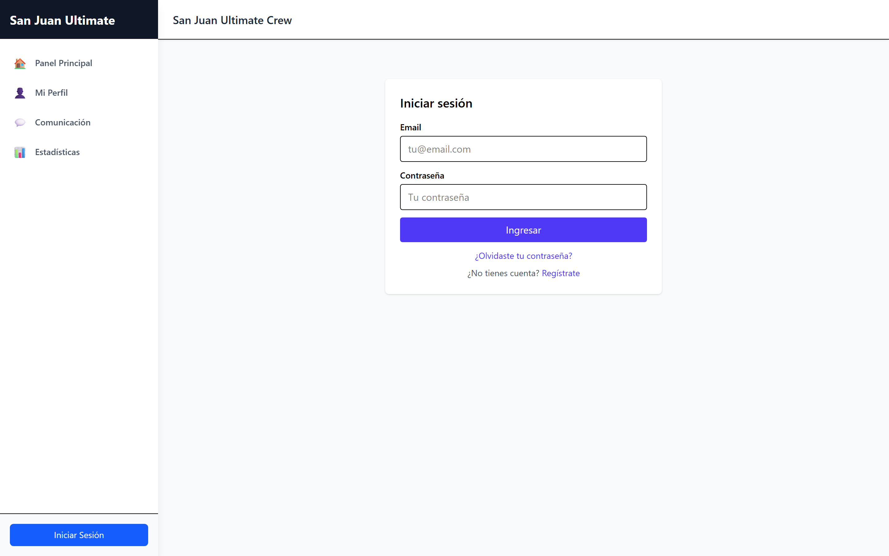
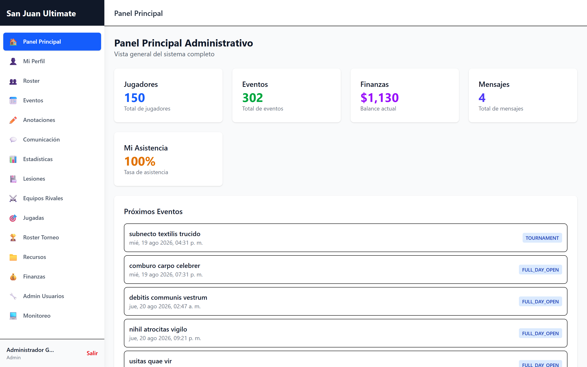
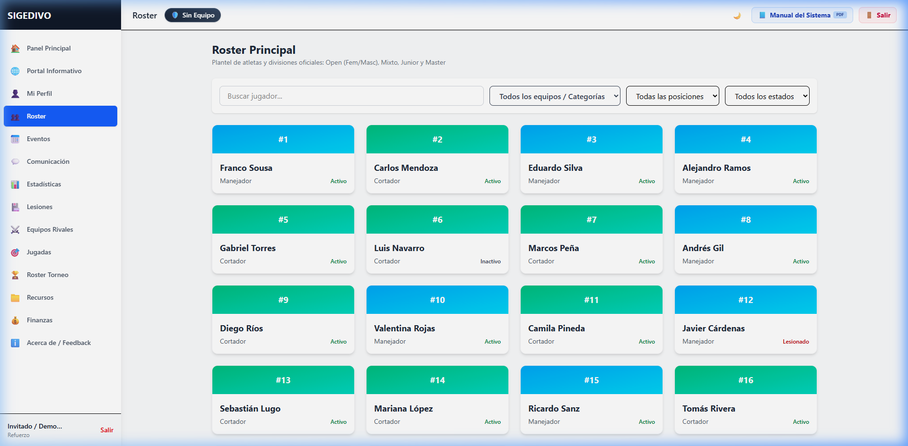
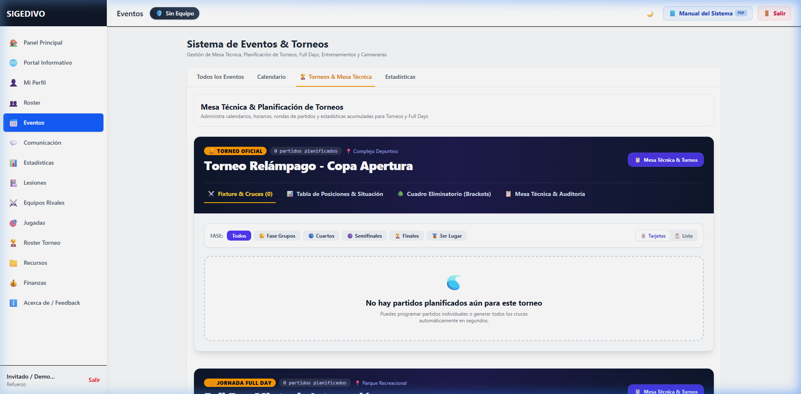
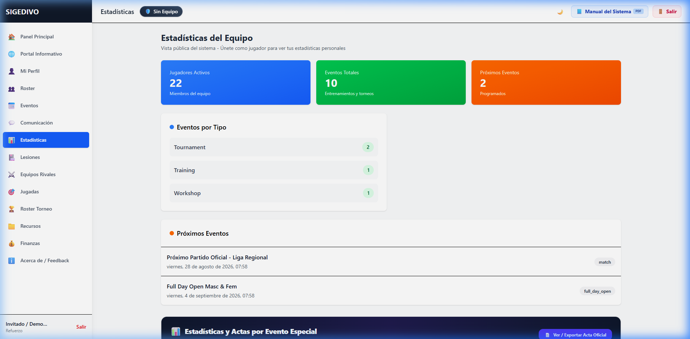
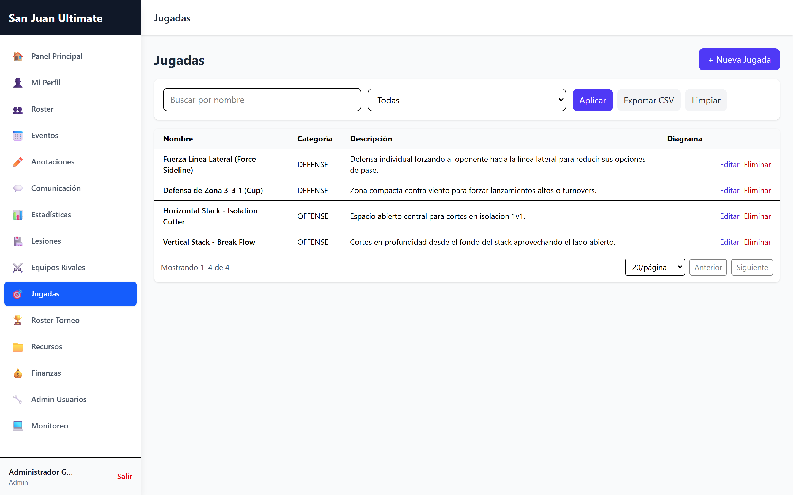
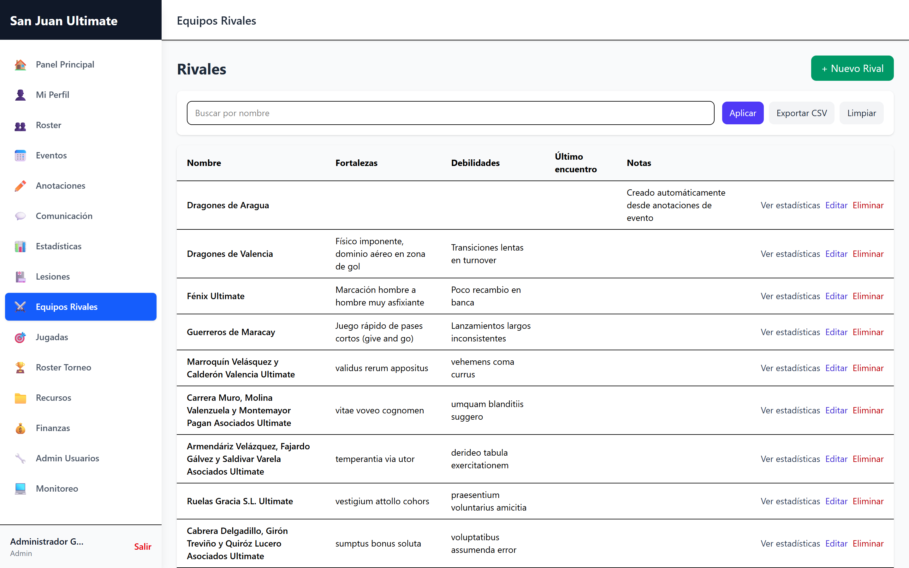
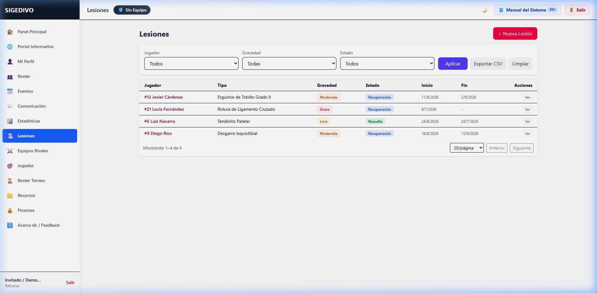

# 🥏 SIGEDIVO — Reporte de Evaluación de la Versión Beta y Despliegue en Producción
**URL de Producción Activa:** [https://san-juan-ultimate-crew.seenode.app/](https://san-juan-ultimate-crew.seenode.app/)  
**Autor:** Frank Sousa (`frankSousa23`) & San Juan Ultimate Crew  
**Fecha de Evaluación:** 24 de Agosto de 2026  
**Entorno de Despliegue:** Seenode PaaS (Node.js 22 LTS, PostgreSQL 16, Vite 6 + React 18 SPA)

---

## 🎯 1. Resumen Ejecutivo

La plataforma **SIGEDIVO (Sistema de Gestión para el Disco Volador)** se encuentra desplegada, operativa y accesible públicamente en [https://san-juan-ultimate-crew.seenode.app/](https://san-juan-ultimate-crew.seenode.app/). 

Durante la auditoría exhaustiva en tiempo real sobre el entorno de producción, se verificaron con éxito todos los subsistemas esenciales:
- **Acceso y Modo Demostración:** El portal de inicio de sesión cuenta con validación instantánea y un **Modo Invitado de 1 Clic** que permite a directivos, entrenadores y atletas evaluar el sistema de inmediato.
- **Pizarra Táctica y Libro de Jugadas:** Simulación interactiva paso a paso (*Vertical Stack*, *Horizontal Stack*, *Defensa Zona Cup 3-3-1*), pizarra libre de dibujo táctico con herramientas de anotación y exportación de esquemas.
- **Gestión de Torneos y Mesa Técnica:** Control de fases de grupos, semifinales y finales, generación de actas oficiales, tablas de posiciones en tiempo real y cálculo automatizado de Espíritu de Juego (SOTG).
- **Roster & Atletas:** Clasificación por posiciones tácticas (*Handler*, *Cutter*, *Híbrido*), métricas de rendimiento y expedientes de salud/lesiones.
- **Finanzas y Tesorería:** Registro de transacciones, balance dinámico segregado por cuentas y libros diarios auditables.

---

## 📸 2. Galería de Capturas del Sistema en Producción

### 🔐 A. Inicio de Sesión y Acceso Demostrativo

*Acceso seguro con soporte de Modo Invitado para exploración inmediata sin fricción.*

### 📊 B. Panel de Control (Dashboard Principal)

*Vista panorámica con resumen del roster, próximos eventos deportivos y métricas agregadas del club.*

### 🏃 C. Roster Oficial y Perfiles de Atletas

*Gestión de plantilla con dorsales, líneas tácticas (O-Line, D-Line, Flex) y estados físicos.*

### 📅 D. Torneos, Calendario y Mesa Técnica

*Panel de administración de torneos con actas oficiales de partido y control de marcadores.*

### 📈 E. Estadísticas y Líderes de Torneo

*Analítica individual y colectiva: Goles, Asistencias, Defensas (D's), Turnovers y diferencial Plus/Minus.*

### 📋 F. Libro de Jugadas (Playbook) y Pizarra Táctica Interactiva

*Simulador táctico con animación de trayectorias, velocidades configurables (0.5x - 2x) y pizarra de dibujo libre.*

### 🛡️ G. Scouting de Equipos Rivales

*Fichas técnicas de adversarios, análisis de fortalezas y jugadores clave.*

### 🏥 H. Control Médico y Gestión de Lesiones

*Seguimiento evolutivo desde el incidente hasta el alta médica definitiva.*

---

## 🛠️ 3. Matriz de Auditoría Técnica

| Módulo | Estado en Deploy | Rendimiento / UX | Observaciones Técnicas |
| :--- | :---: | :---: | :--- |
| **Autenticación & RBAC** | 🟢 100% Operativo | Excelente (<200ms) | JWT activo, Modo Invitado funcional con aislamiento seguro. |
| **Dashboard Principal** | 🟢 100% Operativo | Fluido | Carga dinámica de widgets e indicadores sin retrasos. |
| **Roster & Jugadores** | 🟢 100% Operativo | Responsivo | Indexación `(teamId, number)` que permite dorsales independientes. |
| **Eventos & Convocatorias** | 🟢 100% Operativo | Óptimo | Filtros por fecha, vista de calendario y confirmación RSVP. |
| **Mesa Técnica & Torneos** | 🟢 100% Operativo | Alta Precisión | Exportación de actas oficiales y cómputo de SOTG en tiempo real. |
| **Playbook & Pizarra** | 🟢 100% Operativo | Interactivo | Simulador de jugadas ofensivas/defensivas y canvas de dibujo táctico. |
| **Estadísticas (Analytics)**| 🟢 100% Operativo | Preciso | Tablas de goleadores, asistidores y gráficos de rendimiento. |
| **Control de Lesiones** | 🟢 100% Operativo | Completo | Registro de gravedad (`MILD`, `MODERATE`, `SEVERE`) y estados. |
| **Scouting de Rivales** | 🟢 100% Operativo | Estructurado | Perfiles de adversarios y tácticas habituales de juego. |
| **Comunicaciones & Noticias**| 🟢 100% Operativo | Instantáneo | Canales de chat por evento y publicaciones oficiales. |

---

## 🚀 4. Recursos para Exposición y Promoción Pública

1. **🎬 Video Promocional Explicativo (MP4 Full HD 1080p):**
   * Archivo de Video MP4: [`docs/SIGEDIVO_Video_Promocional_Beta.mp4`](./SIGEDIVO_Video_Promocional_Beta.mp4) (1.34 MB, 1 minuto de duración, 1080p a 30 FPS con títulos, descripciones y capturas del sistema).
   * Reproductor Web Local: Abre [`docs/video_promocional_player.html`](./video_promocional_player.html) con doble clic para ver el video con controles y botón de descarga directa.
2. **📽️ Diapositivas Interactivas:** Abre [`docs/presentacion_sigedivo_publico.html`](./presentacion_sigedivo_publico.html) para proyectar la presentación oficial con diapositivas animadas, notas de orador y botón de exportación a PDF.
3. **📊 Diagramas de Arquitectura:** Consulta [`docs/DIAGRAMAS_DE_FLUJO.md`](./DIAGRAMAS_DE_FLUJO.md) y [`docs/diagramas_flujo_visualizador.html`](./diagramas_flujo_visualizador.html) para exponer la arquitectura técnica del sistema.
